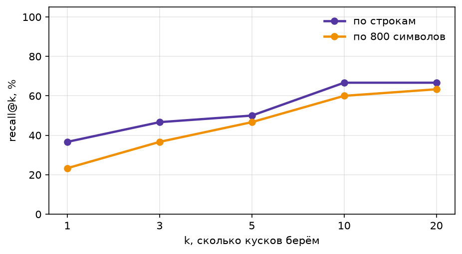
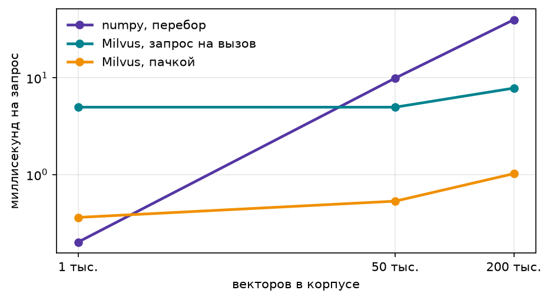
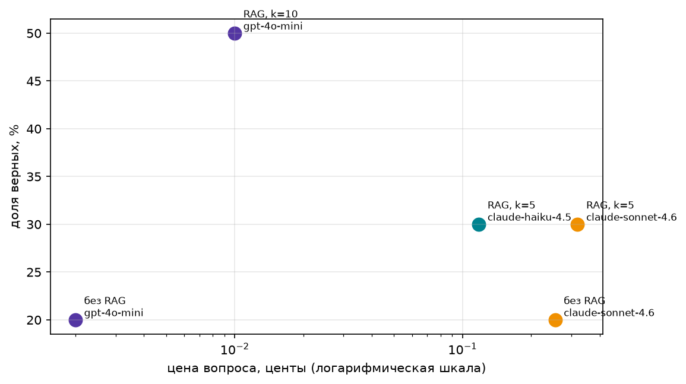
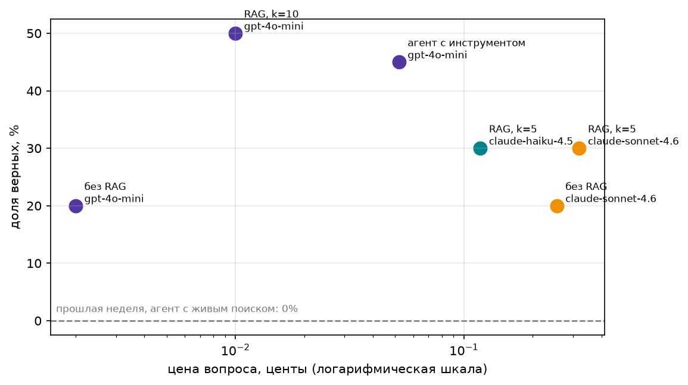
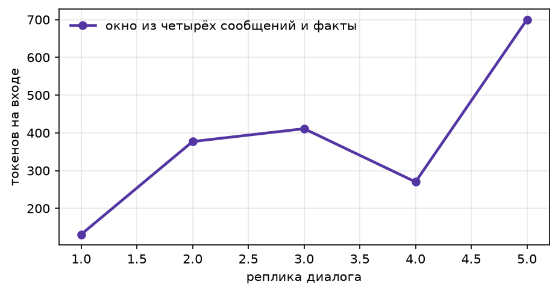

# AgentRAG

Собрать RAG-конвейер от сырого корпуса до агента с памятью, измерить качество поиска и ответов, посчитать цену вопроса. Ноутбук: `agents_rag.ipynb`. Все картинки лежат в `img/`.

---

## 1. Корпус: откуда и какой

**Источник.** 15 обзорных статей с arXiv по запросу `retrieval augmented generation`. Скачиваются скриптами `download_papers(...)` и `build_corpus(...)` (см. ячейки ноутбука), результат складывается в `data/structured_corpus.jsonl`.

**Объём.** 15 документов, **1 032 828 символов** суммарно. У каждого документа есть `doc_id`, `title`, `url`, `text`.

**Вопросы.** `questions.jsonl` - по статьям. Их там дохрена, взяты 30 на которые есть ответ и 10 на которые нет. "id" `q-...` значит что ответ есть, `nq-...`, что нет.

**Очистка (`clean_doc`).** Выкидываем:

- блок `References`/`Bibliography` целиком;
- строки-заголовки `ACM Reference Format`, `Keywords`, `CCS Concepts` и хвост после них;
- абзацы с аффилиациями (University, Institute, Laboratory…);
- одинокие номера страниц.

**Нарезка.** Пробовали две стратегии:

1. **По строкам/абзацам** (`chunk_lines`). Абзацы склеиваются в куски не длиннее 900 символов, минимальная длина 200, иерархия markdown-заголовков едет с куском как метаданные `section`. Внутри абзаца режем по предложениям. Получилось **1 227 кусков**.
2. **Слепое окно по символам** (`chunk_chars`, size=400, overlap=100). **2 842 куска**.

### Recall@k: по строкам vs слепое окно

`не учитываются не отвечаемые вопросы`

| k  | по строкам | по 400 символов |
|----|-----------|-----------------|
| 1  | 0.37      | 0.23            |
| 3  | 0.47      | 0.37            |
| 5  | 0.50      | 0.47            |
| 10 | 0.67      | 0.60            |
| 20 | 0.67      | 0.63            |

Нарезка по строкам немного выигрывает на всех k. Чтобы дальше повысить надо что-то ещё с чанкированием делать, тут хз.

---

## 2. Гибридный поиск

Сравнивали три варианта:

- **только вектор** — косинус по нормализованным эмбеддингам `text-embedding-3-small`, размерность 512;
- **только слова** — BM25-подобная функция на IDF-весах (`keyword_search`);
- **гибрид RRF** — Reciprocal Rank Fusion двух ранжирований, K=60.

| нарезка        | поиск        | recall@1 | recall@5 |
|----------------|--------------|----------|----------|
| по 400 символов| только вектор| 0.18     | 0.35     |
| по 400 символов| только слова | 0.32     | 0.45     |
| по 400 символов| гибрид RRF   | 0.18     | 0.38     |
| по строкам     | только вектор| 0.28     | 0.38     |
| по строкам     | только слова | 0.40     | 0.55     |
| по строкам     | гибрид RRF   | 0.35     | 0.52     |

- Вопросы могут содержать точные имена, числа и аббревиатуры — их вектор ловит хуже.

---

## 3. Milvus

Замер скорости на трёх размерах корпуса (корпус раздут шумом до 50k и 200k векторов):

| векторов | numpy, перебор | Milvus, запрос на вызов | Milvus, пачкой |
|----------|----------------|-------------------------|----------------|
| 1 227    | 0.20 мс        | 4.98 мс                 | 0.36 мс        |
| 50 000   | 9.95 мс        | 4.98 мс                 | 0.53 мс        |
| 200 000  | 39.95 мс       | 7.84 мс                 | 1.02 мс        |

numpy линейно растёт и упирается в 40 мс на 200k. Milvus с батчевыми запросами держит 1 мс. На нашем корпусе numpy быстрее по штучным вызовам, но зато у Milvus константа не зависит от размера.

---

## 4. RAG-ответ: качество и деньги

Собрали пять конфигураций на 40 вопросах, все считаются через OpenRouter, леджер пишет цену каждой реплики.

| config     | model              | n  | accuracy | cost/task | cost/correct |
|------------|--------------------|----|----------|-----------|--------------|
| без RAG    | gpt-4o-mini        | 40 | 0.20     | 0.00002   | 0.00012      |
| без RAG    | claude-sonnet-4.6  | 40 | 0.20     | 0.00255   | 0.01273      |
| RAG, k=10  | gpt-4o-mini        | 40 | 0.50     | 0.00010   | 0.00020      |
| RAG, k=5   | claude-haiku-4.5   | 40 | 0.30     | 0.00118   | 0.00395      |
| RAG, k=5   | claude-sonnet-4.6  | 40 | 0.30     | 0.00320   | 0.01066      |

Что видно:

- RAG поднимает accuracy **с 20% до 50%** на той же дешёвой модели. Это и есть главный эффект retrieval. (примечание - вероятно правильные это NOT_FOUND, вопросы слишком неочевидные без контекста, поэтому на 30 всё сыпется без RAG)
- Сильные модели без RAG не спасают.
- С RAG сильные модели проигрывают gpt-4o-mini. Причина в top-k. Ранее было, что в топ 10 большая часть вопросов попадает. Но с gpt-4o-mini наверное top-10 резонно использовать, а с дорогими уже менее.

### Как выбирать k

| k  | accuracy | cost/task |
|----|----------|-----------|
| 1  | 0.425    | 0.00005   |
| 3  | 0.450    | 0.00007   |
| 5  | 0.475    | 0.00010   |
| 10 | 0.525    | 0.00017   |

На этом корпусе accuracy растёт линейно с k, платим тоже линейно. Останавливаться на k=5 или k=10 — вопрос бюджета. При 200k векторов контекст станет узким местом, и рост k перестанет окупаться.

---

## 5. Где ломается RAG

Разложили ошибки на две кучки: «поиск не нашёл» и «нашёл, но модель ответила неверно».

| model             | не нашли | нашли, но ответили неверно |
|-------------------|----------|----------------------------|
| claude-haiku-4.5  | 26       | 2                          |
| claude-sonnet-4.6 | 26       | 2                          |
| gpt-4o-mini       | 17       | 3                          |

Главная точка отказа — retrieval. У обеих сильных моделей 26 из 28 ошибок это «правильный кусок не попал в топ». Generation ошибается редко: 2–3 случая из 40, и то в основном там, где поиск достал соседний, но не тот параграф.

Что это значит для практики: чинить нужно поиск, а не промпт. Гибрид, переупорядочивание, лучший чанкинг, а не «попросить модель быть внимательнее».

---

## 6. Память агента

Реализовали две памяти из четвёртой лекции:

- **Эпизодическая** — журнал всех реплик в `episodes.jsonl`, в контекст не идёт.
- **Семантическая** — короткие факты о пользователе, дешёвая модель извлекает их из диалога отдельным вызовом и возвращает обновлённый список целиком, так что «переехал», «больше не интересуюсь» заменяют старый факт, а не ложатся рядом. Факты лежат в Milvus отдельной коллекцией `facts`, к каждому вопросу достаём три ближайших.

| config             | prompt-токенов на диалог | cost      |
|--------------------|--------------------------|-----------|
| окно из 4 + факты  | 6 796                    | 0.00149   |
| вся история        | 16 315                   | 0.00193   |

---

## Итоги

1. **Нарезка влияет сильнее, чем модель.** По строкам vs по 400 символов: recall@1 0.37 vs 0.23, accuracy 0.50 vs 0.20 на той же модели.
2. **Слова выигрывают у вектора на фактологических вопросах.** Гибрид RRF на нашем корпусе не обгоняет слова, но на смешанных корпусах нужен.
3. **Сильная модель не заменяет хороший retrieval.** Sonnet с RAG = 30%, gpt-4o-mini с RAG = 50%. Разница не в модели, а в том, что Haiku/Sonnet склонны сдаваться в NOT_FOUND.
4. **Главная точка отказа — поиск, не генерация.** У сильных моделей 26 ошибок из 28 — retrieval.
5. **Память экономит линейно растущий контекст.** На 10 репликах разница 6.8k vs 16.3k токенов, дальше разрыв только растёт.
6. **Агент полезен как надстройка, но не чинит retrieval.** Он упирается в ту же стену.